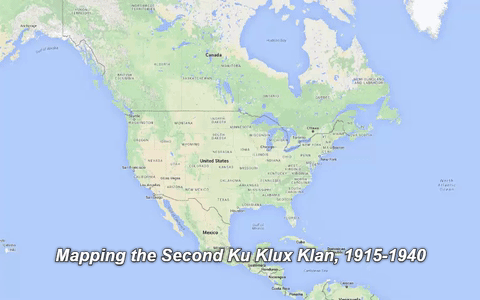

## Source

[Mapping the Second Ku Klux Klan, 1915-1940](https://labs.library.vcu.edu/klan/)

## Evaluation

“Mapping the Second Ku Klux Klan” is a digital humanities project hosted by Virginia Commonwealth University. It is mostly a tool and does not give any conclusions on the data given, but is mostly there to present the data so the reader can make their own conclusions. This is for a variety of reasons, but the main reasons are key problems with the data. For one this data only adds points to the map when they got documentary evidence of a Klavern appearing in that location. The Klavern could have been there for much longer, or it could have died out shortly, we do not know. This comes to the second problem of the data. While you can look at how many new Klaverns were discovered each year, you can not actually look at how many existed at any given time due to the fact that this data was only when they were created and reported on in the news.

Either way, this project can be used to analyze and show the popularity of the Ku Klux Klan, how fast they spread, and where they spread to. Here are some key takeaways, the second wave of the Ku Klux Klan got its base established in 1920 in Texas and Oklahoma. From there they spread to neighboring states but did not become a national phenomenon until 1923 and 1924 when both popularity and reporting on the Klaverns skyrocketed. After that, the Ku Klux Klan lost popularity in both the news and recruitment, slowly dying out again.

Overall this project was very interesting, but sadly its data is not fully complete so it does not have many uses besides research into the forming of Klans. The sources for their data mostly come from newspapers sponsored by or sympathetic to the Klu Klux Klan. Despite the little information provided by the data, multiple news publications wrote about this digital humanities project as it can be very interesting to a reader at a glance and shows how far the KKK spread. It was not just a midwest problem and really spread everywhere from 1923 to 1924.  
