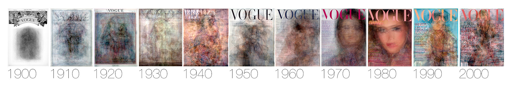

## Source

[Robots Reading Vogue](http://dh.library.yale.edu/projects/vogue/)

## Evaluation

“Robots Reading Vogue” is a very interesting digital humanities project. It is mostly a digital repository that contains different projects done on the 6 TB of data Vogue has published consistently since the 1900s. It is hosted in the Yale University Library, and its only goal is to highlight some of the interesting digital humanities projects done on Vogue. Since Vogue is a mostly women’s beauty and fashion magazine and has been published for over a century, the data can be used to look at gender studies in the United States of America, especially when looking at how beauty was portrayed in different years. The data can also be used to analyze Vogue as a company and magazine publisher, but that is not as exciting. 

The three most interesting projects, in my opinion, are Word Vectors, Cover Averages, and Topic Modeling. Sadly the n-gram Search project seems to be no longer functional. 

Cover Averages is one of the most straightforward projects as it shows how Vogue has changed its covers over the years. It does this by taking all the covers released in one decade and averaging the pixels. They hand-aligned all the covers first to make sure the result was not a pure mess. In the begging, they had a consistent black-and-white title with some images in the center. After that, the articles became inconsistent until the 1950s. That is when Vogue developed its title font and has kept it at the top of their magazine since with only slight changes. Other details are shown like how in the 1980s there was an emphasis on close-ups, but they have since moved back to farther-away angles.

Word Vectors and Topic Modeling can both be used to look at how the definition of beauty in vogue has changed over the years, but it is mostly the focus of the Word Vectors project. This project measured Vogue's definition of beauty using a word embedding model which works by taking a word like beauty and creating a dense matrix of all the other words that were found to be used with beauty. The computer does not know the actual definition of the words, but can still analyze the placement of the words and how they co-occur. To summarize their findings, in the 19th and 20th centuries beauty was seen as “charm, elegance, and grace” to name a few definitions. This changed in the 20th century when the focus began to be transferred to how you can use products to become beautiful through actions like “skin care” or by using items like “creams, oils, and powder”. This change because even more dramatic in the 21st century where they define beauty as a commodity that one buys

